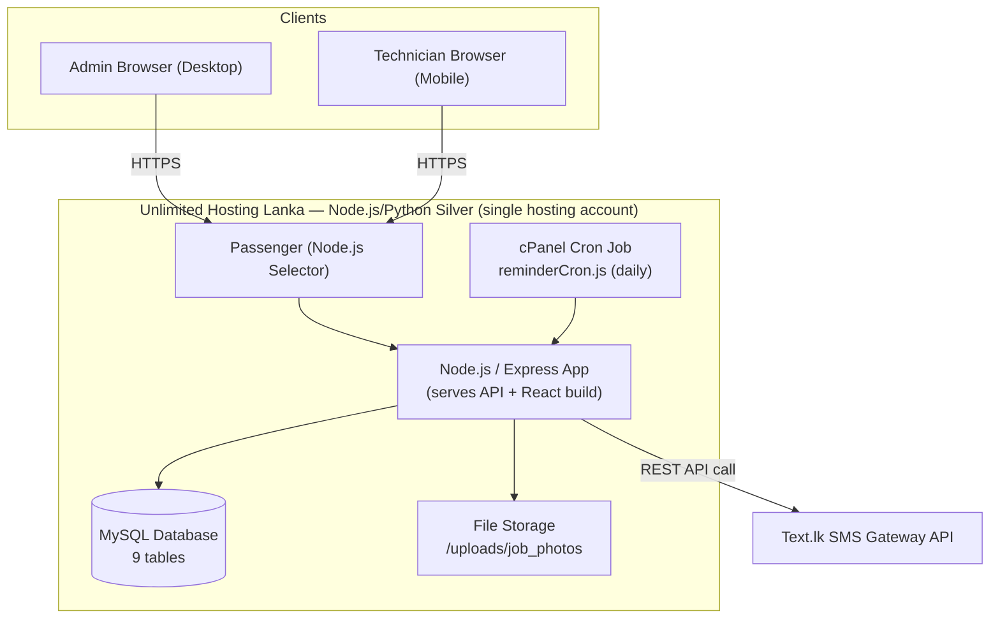
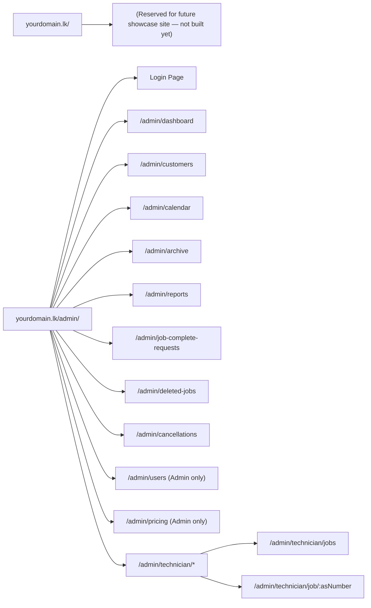

# System Architecture — Backend → Frontend → Hosting

This describes exactly how the system runs, physically and logically, from the database up to the browser.

---

## 1. High-Level Architecture



**Key point:** everything — API, frontend, and database — runs on **one hosting account**. There is no separate frontend host, no separate database server, and no separate application server. This keeps cost and operational complexity minimal.

---

## 2. Backend Layer (Node.js / Express)

- Express serves two things from the same process:
  1. **`/api/*`** routes — all business logic (auth, customers, agreements, jobs, sms, reports)
  2. **`/admin/*`** — the React production build's static files (`index.html`, JS, CSS) — the entire system (Admin + Technician sections) lives under this one path prefix, since the root domain is reserved for a future showcase site

```js
// app.js — the core of how backend + frontend coexist in one app
app.use('/api', apiRouter);
app.use('/admin', express.static('client/build'));
app.get('/admin/*', (req, res) => res.sendFile(path.join(__dirname, 'client/build/index.html')));

// Root path: reserved for a future showcase site.
// For now, simplest options are a placeholder page, or a redirect straight into the system:
app.get('/', (req, res) => res.redirect('/admin'));
```

- Backend talks to **MySQL** on `localhost` (same server) via `mysql2` or an ORM (Sequelize/Knex)
- Backend talks to **Text.lk** over HTTPS for SMS sending
- Backend reads/writes job photos to a local `/uploads/job_photos/` folder (outside `public_html`, served only via an authenticated route)

---

## 3. Frontend Layer (React)

- **Built locally** (or in CI) via `npm run build` → produces a static `build/` folder
- That folder is uploaded into the Node app's directory and served by Express — **no separate hosting needed**
- **Revised routing decision:** the root domain (`yourdomain.lk/`) is reserved for a future company showcase/marketing site (not part of this system, to be built later). **The entire system — both Admin and Technician sections — is mounted under a single `/admin` base path** for now.
- **React Router** uses a `basename="/admin"` so all internal routes sit under that prefix automatically:



- Role-based route guards on the frontend (redirect if wrong role) — but the **real** security is backend-side JWT role checks on every API call, since URLs alone are not protection

---

## 4. Database Layer (MySQL)

- Single MySQL database, same server as the app (no networking config needed)
- 9 tables: `customers`, `ac_units`, `agreements`, `jobs`, `job_photos`, `sms_logs`, `users`, `pricing` — see `06_Database_Design.md` (revised per client wireframes: 3 roles, Normal/H-P count model, completion approval flow)
- Full schema in `06_Database_Design.md`, setup SQL in `07_Database_Setup_Guide_MySQL.md`

---

## 5. Hosting Layer (cPanel specifics)

**How cPanel runs a Node.js app:**
- cPanel uses **CloudLinux's Node.js Selector**, backed by **Phusion Passenger**, to supervise the Node process
- Under *Setup Node.js App* in cPanel, you configure: Node version, application root, application URL, startup file (`app.js`), and environment variables (DB credentials, JWT secret, Text.lk API key)
- Passenger assigns an internal port automatically and proxies the domain's traffic straight to the Express app — no manual port management

**Domain routing:**
- Once the `.lk` domain is purchased and pointed to this hosting account (post-development, before go-live), it's attached as the app's Application URL
- Requests to `highcool.lk/admin`, `highcool.lk/admin/dashboard`, `highcool.lk/admin/technician/job/AS-00123` all hit the Express `/admin/*` catch-all, and React Router (with `basename="/admin"`) renders the correct screen client-side
- `highcool.lk/` itself is reserved for the future showcase site — for now it can either show a simple placeholder or redirect straight into `/admin`

**Deployment workflow:**
1. Push code via cPanel's Git Version Control (or SFTP/File Manager)
2. Click **"Run NPM Install"** in the Node.js App interface
3. Click **"Restart"** to reload the app
4. For frontend-only changes: rebuild React locally, re-upload `build/`, restart

**Cron (SMS reminders):**
```
0 8 * * * /usr/bin/node /home/username/ac-service-app/src/jobs/reminderCron.js
```
Runs daily at 8am, checks for jobs due tomorrow, triggers reminder SMS via Text.lk.

**SSL:** Free Let's Encrypt certificate via cPanel, auto-renews, activated once the domain is attached.

---

## 6. Security Model Summary

| Layer | Protection |
|---|---|
| Passwords | bcrypt hashing, never stored in plaintext |
| Sessions | JWT tokens, role embedded and checked server-side |
| Routes | Role-guarded on frontend (UX) **and** backend (actual enforcement) |
| Photos | Stored outside public web root, served only via authenticated route |
| Transport | HTTPS enforced via free Let's Encrypt SSL |
| Data integrity | Soft-deletes only (agreements never hard-deleted) — full audit trail preserved |
