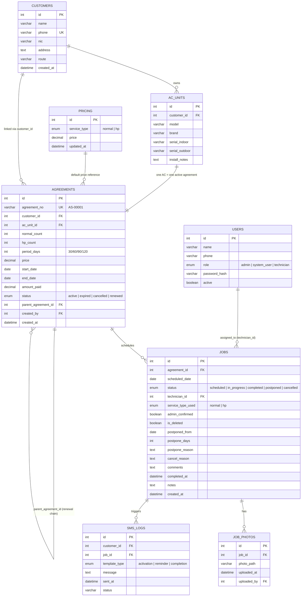

# Database Design — AC Service Management System (Revised per Wireframes)

MySQL, **9 tables** (was 7 — added `pricing`; expanded fields per client wireframes). Everything keys off the Agreement (`AS-` number), cross-linked to a Customer via NIC/Phone.

> **Revision note:** This replaces the earlier 7-table version after reviewing the client's hand-drawn wireframes. Key changes: 3 roles (not 2), richer AC unit details (model/brand/dual serials), agreements now track separate Normal/H-P visit counts + a period instead of one fixed service type, jobs track which type each visit actually was, a completion-approval flow, and a pricing table.

---

## Entity Relationship Diagram

---

## Table Reference

### `users` (3 roles now)
| Field | Type | Notes |
|---|---|---|
| id | INT, PK, AUTO_INCREMENT | |
| name | VARCHAR(150) | |
| phone | VARCHAR(20) | |
| role | ENUM('admin','system_user','technician') | **Admin** = total authority (users, pricing, everything). **System User** = day-to-day operations (customers, agreements, jobs, calendar) — no user management, no pricing access. **Technician** = own jobs only. |
| password_hash | VARCHAR(255) | bcrypt hash |
| active | BOOLEAN | disable without deleting |
| created_at | DATETIME | |

### `customers` — unchanged
| Field | Type | Notes |
|---|---|---|
| id | INT, PK, AUTO_INCREMENT | |
| name | VARCHAR(150) | |
| phone | VARCHAR(20), UNIQUE, INDEXED | acts as customer ID |
| nic | VARCHAR(20), INDEXED | primary search key |
| address | TEXT | |
| route | VARCHAR(255) | Sinhala or English free text |
| created_at | DATETIME | basis for loyalty duration |

### `ac_units` — expanded per wireframe
| Field | Type | Notes |
|---|---|---|
| id | INT, PK, AUTO_INCREMENT | |
| customer_id | INT, FK → customers.id | |
| model | VARCHAR(100) | **new** |
| brand | VARCHAR(100) | **new** |
| serial_indoor | VARCHAR(100) | **new** — indoor unit serial |
| serial_outdoor | VARCHAR(100) | **new** — outdoor unit serial |
| install_notes | TEXT | optional |

### `agreements` — service model replaced
| Field | Type | Notes |
|---|---|---|
| id | INT, PK, AUTO_INCREMENT | |
| agreement_no | VARCHAR(20), UNIQUE | format `AS-00001` |
| customer_id | INT, FK → customers.id | |
| ac_unit_id | INT, FK → ac_units.id | |
| normal_count | INT | **new** — number of Normal visits allocated this year |
| hp_count | INT | **new** — number of H/P (Hybrid) visits allocated this year |
| period_days | INT | **new** — days between visits: 30 / 60 / 90 / 120 |
| price | DECIMAL(10,2) | **new** — agreed price for this agreement (pulled from `pricing` table by default, editable per agreement) |
| start_date | DATE | |
| end_date | DATE | start_date + 1 year |
| amount_paid | DECIMAL(10,2) | |
| status | ENUM('active','expired','cancelled','renewed') | |
| parent_agreement_id | INT, FK → agreements.id, NULLABLE | links renewal chain |
| created_by | INT, FK → users.id | |
| created_at | DATETIME | |

> **Removed:** the old single `service_type ENUM('normal','hybrid')` field — replaced by `normal_count` + `hp_count`, since an agreement can now mix both types (e.g. 2 Normal + 2 H/P visits) rather than being locked to one type.

### `jobs` — expanded per wireframe
| Field | Type | Notes |
|---|---|---|
| id | INT, PK, AUTO_INCREMENT | |
| agreement_id | INT, FK → agreements.id | |
| scheduled_date | DATE | |
| status | ENUM('scheduled','in_progress','completed','postponed','cancelled') | |
| technician_id | INT, FK → users.id, NULLABLE | |
| service_type_used | ENUM('normal','hp'), NULLABLE | **new** — set by technician when they execute the visit; decrements the corresponding count on the agreement |
| admin_confirmed | BOOLEAN, DEFAULT FALSE | **new** — powers the "Job Complete Requests" queue; technician marking complete doesn't finalize it until admin confirms |
| is_deleted | BOOLEAN, DEFAULT FALSE | **new** — powers the "Deleted Jobs" view (soft-delete at job level, separate from a full cancellation) |
| postponed_from | DATE, NULLABLE | |
| postpone_days | INT, NULLABLE | **new** — number of days postponed, as shown in wireframe |
| postpone_reason | TEXT, NULLABLE | |
| cancel_reason | TEXT, NULLABLE | **new** — required when a job is cancelled |
| comments | TEXT, NULLABLE | **new** — general notes/comments thread on the job |
| completed_at | DATETIME, NULLABLE | |
| notes | TEXT | |
| created_at | DATETIME | |

### `job_photos` — unchanged structure, new limit
| Field | Type | Notes |
|---|---|---|
| id | INT, PK, AUTO_INCREMENT | |
| job_id | INT, FK → jobs.id | |
| photo_path | VARCHAR(255) | |
| uploaded_at | DATETIME | |
| uploaded_by | INT, FK → users.id | |

**Enforced at application level:** minimum **4** photos required before a job can be marked complete, maximum **5** photos per job, 5MB each.

### `sms_logs` — unchanged
| Field | Type | Notes |
|---|---|---|
| id | INT, PK, AUTO_INCREMENT | |
| customer_id | INT, FK → customers.id | |
| job_id | INT, FK → jobs.id, NULLABLE | |
| template_type | ENUM('activation','reminder','completion') | |
| message | TEXT | |
| sent_at | DATETIME | |
| status | VARCHAR(50) | |

### `pricing` — new table
| Field | Type | Notes |
|---|---|---|
| id | INT, PK, AUTO_INCREMENT | |
| service_type | ENUM('normal','hp') | |
| price | DECIMAL(10,2) | |
| updated_at | DATETIME | |

Powers the Admin-only "Add Price" screen — sets default pricing per service type, which pre-fills the `agreements.price` field (still editable per individual agreement).

---

## Relationship Summary

- `customers` 1—many `ac_units`
- `customers` 1—many `agreements` (across all their ACs and renewal years)
- `ac_units` 1—1 `agreements` (an AC has one *active* agreement at a time; history via renewal chain)
- `agreements` 1—many `jobs`
- `agreements` self-referencing via `parent_agreement_id` (renewal history chain)
- `jobs` 1—many `job_photos`
- `jobs` 1—many `sms_logs`
- `users` 1—many `jobs` (as assigned technician)
- `pricing` referenced by `agreements.price` at creation time (not a hard FK — just a default lookup)

## Indexing Notes

- `customers.nic` and `customers.phone` — indexed (primary search keys)
- `agreements.agreement_no` — unique index (looked up directly by technicians)
- `jobs.scheduled_date` — indexed (calendar view + reminder cron query by date)
- `jobs.technician_id` — indexed (reports filter/group by technician)
- `jobs.admin_confirmed` — indexed (Job Complete Requests queue filters on this)
- `jobs.is_deleted` — indexed (Deleted Jobs view filters on this)

## How Visit Scheduling Now Works (Revised)

1. At agreement creation: `normal_count` + `hp_count` = total visits for the year, spaced `period_days` apart
2. `schedulerService.js` generates `(normal_count + hp_count)` rows in `jobs`, each `period_days` apart starting from `start_date`
3. `service_type_used` is left NULL until the technician actually performs that visit and tags it Normal or H/P
4. (Optional application-level check, not enforced at DB level) — once `normal_count` visits have been tagged 'normal' and `hp_count` visits tagged 'hp', no further visits should be created without a renewal
