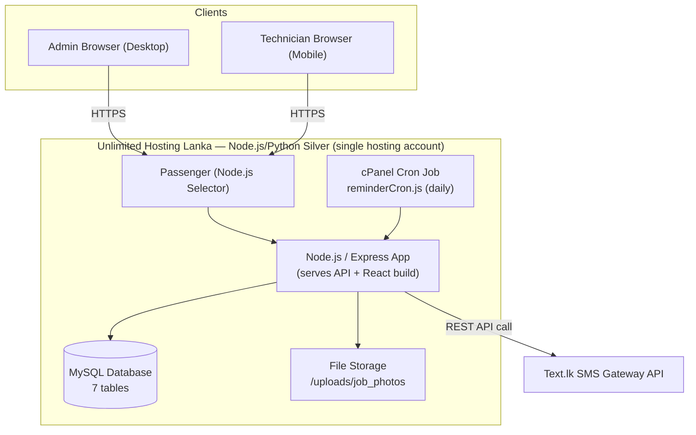
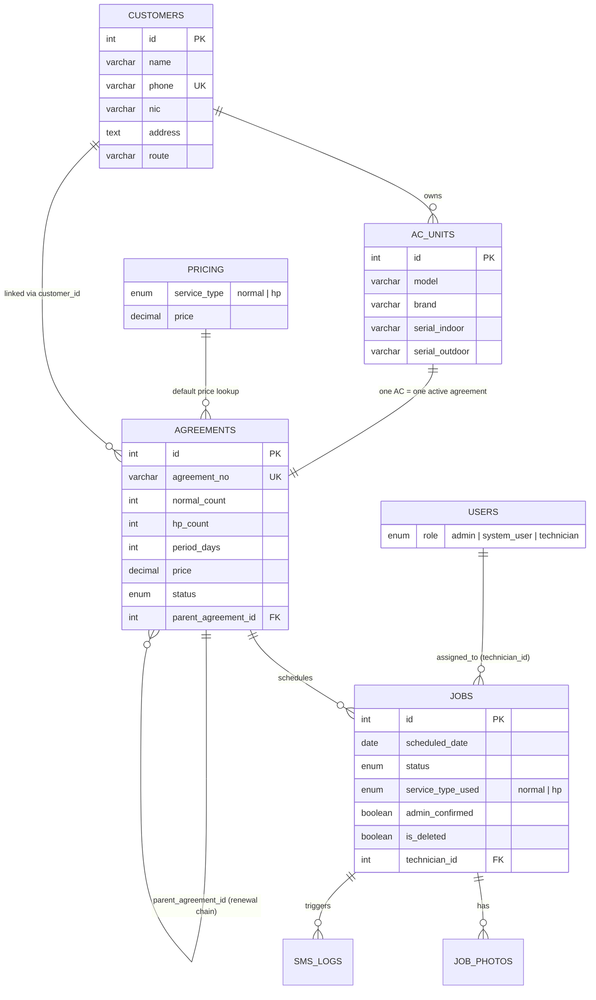
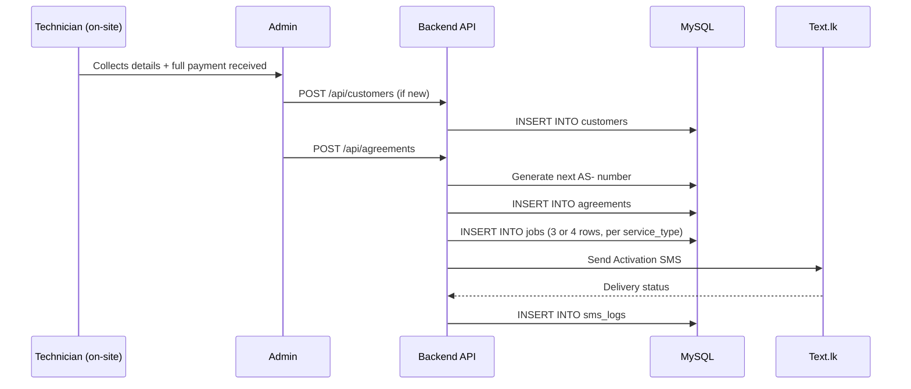
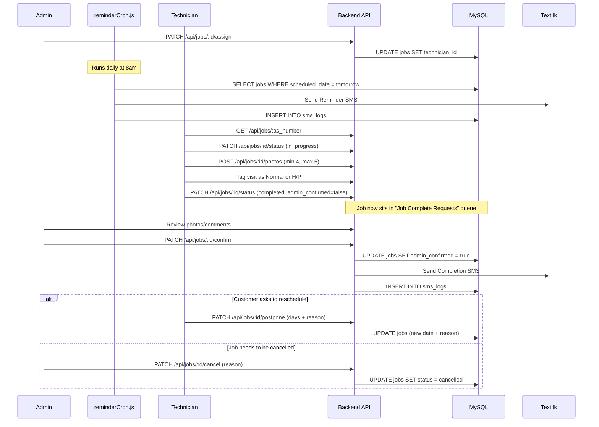
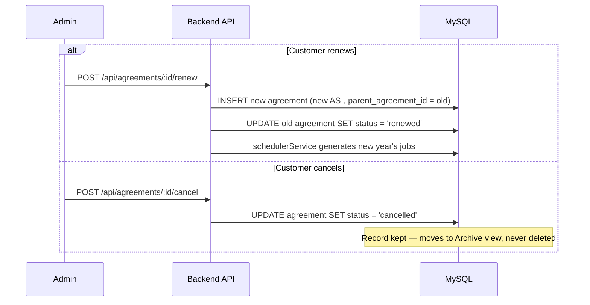
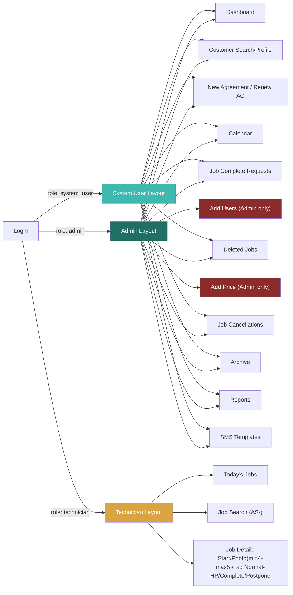
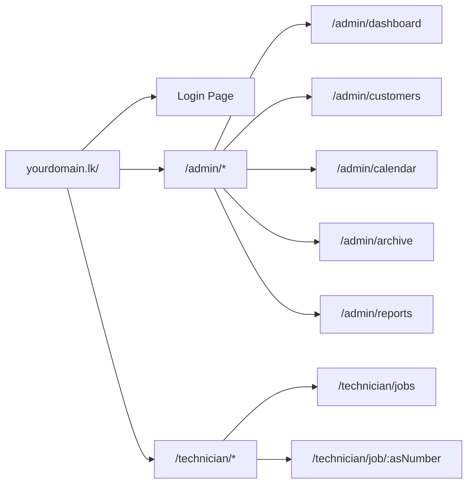
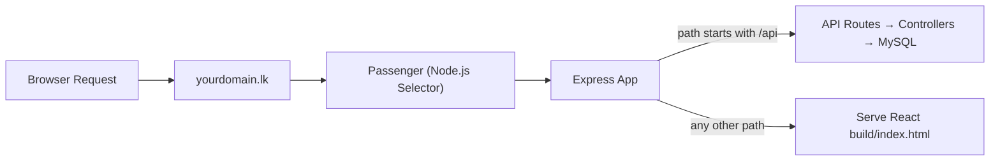

# Diagrams — AC Service Management System (Revised per Wireframes)

> Updated after reviewing the client's hand-drawn wireframes: 3 roles, Normal/H-P visit-type tagging, completion approval flow, and status color-coding are now reflected below.

All diagrams in one place, written in **Mermaid** syntax — renders natively in GitHub, GitLab, Obsidian, VS Code (with Mermaid extension), and most modern markdown viewers.

---

## 1. System Architecture (Backend → Frontend → Hosting)

---

## 2. Entity Relationship Diagram (Database) — Revised

---

## 3. Data Flow A — Registration → Activation

---

## 4. Data Flow B — Job Lifecycle (Revised: type-tagging + completion approval)

---

## 5. Data Flow C — Renewal & Archive

---

## 6. Role & Access Diagram (Revised — 3 roles)

---

## 7. URL / Routing Structure

---

## 8. Deployment / Request Routing on cPanel

